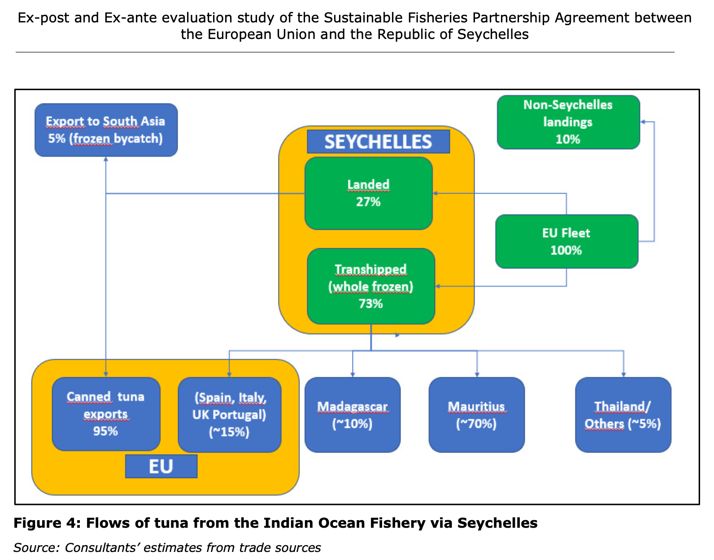
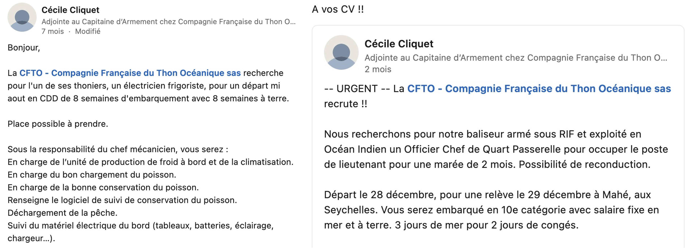

```{r setup, include=FALSE}
knitr::opts_chunk$set(echo = TRUE, message = FALSE, warning = FALSE)
```

We load the packages

```{r}
source("https://www.dropbox.com/s/lzdnoe69iex1le1/load_packages.R?dl=1") #Load packages

load_packages("lubridate",
              "tidyverse",
              "readxl",
              "openxlsx",
              "janitor",
              "vroom",
              "sf",
              "rnaturalearth", 
              "gfwr", 
              "cowplot",
              "kableExtra", 
              "priceR")

sequestration_factors <- read.xlsx("output/Data/sequestration_factors.xlsx")

```

# Estimation of fuel tax concessions in the european tropical tuna fishery

We first load the fleet statistics from the STECF database (<https://stecf.jrc.ec.europa.eu/dd/fleet>). We keep the data of the entire spanish and french fleet to estimate the contribution of tropical tuna purse seiners for fuel consumption.

```{r}

data_stecf_fleet_stat <- read.xlsx ("https://www.dropbox.com/scl/fi/clfv9v19rkivo20qu1b0q/STECF-22-06-EU-Fleet-Economic-and-Transversal-data_fleet-segment.xlsx?rlkey=e3kjhv49bc0tv6jb281i7geah&dl=1", sheet = 2) %>%
  select(country = country_name, year, area = supra_reg, gear_code = fishing_tech, length_class = vessel_length, variable = variable_name, value) %>%
  filter (variable %in% c("Number of vessels", "Energy consumption", "FTE national", "Engaged crew", "Other variable costs", "Other non-variable costs", "Repair & maintenance costs", "Energy costs", "Personnel costs", "Gross value of landings", "Other income") & country %in% c("France", "Spain")) %>%
  pivot_wider (names_from = variable, values_from = value) %>%
  clean_names () %>%
  unnest () %>%
  with_groups (c("country", "year", "area", "gear_code", "length_class"), summarise, number_of_vessels = sum(number_of_vessels, na.rm = T), energy_consumption = sum(energy_consumption, na.rm = T), fte_national = sum(fte_national, na.rm = T), engaged_crew = sum(engaged_crew, na.rm = T), other_variable_costs = sum(other_variable_costs, na.rm = T), other_non_variable_costs = sum(other_non_variable_costs, na.rm = T), repair_maintenance_costs = sum(repair_maintenance_costs, na.rm = T), energy_costs = sum(energy_costs, na.rm = T), personnel_costs = sum(personnel_costs, na.rm = T), gross_value_of_landings = sum(gross_value_of_landings, na.rm = T), other_income = sum(other_income, na.rm = T)) %>%
  filter (year != 2021 & year != 2008) # data for year 2021 are incomplete and fuel consumption data are missing for year 2008

```

The following table gives the relative importance in terms of fuel consumption of the spanish and french tropical tuna purse seiners over the years :

```{r}

data_stecf_fleet_stat %>%
    with_groups (c("year", "country"), mutate, energy_consumption_perc = round(energy_consumption*100/sum(energy_consumption, na.rm = T), 1)) %>%
    filter (area == "OFR" & gear_code == "PS" & length_class == "VL40XX") %>%
    filter (energy_consumption_perc > 0 & energy_consumption_perc != "NAN") %>%
    select (year, country, energy_consumption, energy_consumption_perc) %>%
    mutate(energy_consumption = format(energy_consumption, big.mark = ",")) %>%
  kable () %>%
  kable_paper(full_width = T) %>%
  kable_styling(bootstrap_options = c("striped", "condensed", "responsive", "hover")) %>%
  row_spec(0, bold = TRUE)

```


Fuel consumption by French tropical tuna seiners over the 2008-2020 period represents an average of `r data_stecf_fleet_stat %>% with_groups (c("year", "country"), mutate, energy_consumption_perc = round(energy_consumption*100/sum(energy_consumption, na.rm = T), 1)) %>% filter (area == "OFR" & gear_code == "PS" & length_class == "VL40XX") %>% filter (energy_consumption_perc > 0 & energy_consumption_perc != "NAN") %>% with_groups(country, summarise, energy_consumption = mean(energy_consumption_perc)) %>% filter (country == "France") %>% pull (energy_consumption)`% of total consumption by the French fleet. It represents annually `r data_stecf_fleet_stat %>% filter (area == "OFR" & gear_code == "PS" & length_class == "VL40XX" & energy_consumption > 1) %>% select (year, country, energy_consumption) %>% with_groups(country, summarise, energy_consumption = format(mean(energy_consumption), big.mark = ",")) %>% filter (country == "France") %>% pull (energy_consumption)` L of fuel consumed. 

Fuel consumption of Spanish tropical tuna seiners over the 2008-2020 period represents on average `r data_stecf_fleet_stat %>% with_groups (c("year", "country"), mutate, energy_consumption_perc = round(energy_consumption*100/sum(energy_consumption, na.rm = T), 1)) %>% filter (area == "OFR" & gear_code == "PS" & length_class == "VL40XX") %>% filter (energy_consumption_perc > 0 & energy_consumption_perc != "NAN") %>% with_groups(country, summarise, energy_consumption = mean(energy_consumption_perc)) %>% filter (country == "Spain") %>% pull (energy_consumption)`% of the total consumption of the Spanish fleet. It represents annually `r data_stecf_fleet_stat %>% filter (area == "OFR" & gear_code == "PS" & length_class == "VL40XX" & energy_consumption > 1) %>% select (year, country, energy_consumption) %>% with_groups(country, summarise, energy_consumption = format(mean(energy_consumption), big.mark = ",")) %>% filter (country == "Spain") %>% pull (energy_consumption)` L of fuel consumed. 

We filter the fleet statistics to keep only data related to tropical tuna purse seiners.

```{r}

data_stecf_fleet_stat <- data_stecf_fleet_stat %>%
  filter (area == "OFR" & gear_code == "PS" & length_class == "VL40XX") %>%
  rowwise () %>%
  mutate (gross_operating_profit = gross_value_of_landings + other_income - (other_variable_costs + other_non_variable_costs + repair_maintenance_costs + energy_costs + personnel_costs),
          operating_profit_margin = gross_operating_profit *100/ (gross_value_of_landings + other_income)) %>%
  ungroup () %>%
  mutate_at (.vars = c("other_variable_costs", "other_non_variable_costs", "repair_maintenance_costs", "energy_costs", "personnel_costs", "gross_value_of_landings", "other_income", "gross_operating_profit", "operating_profit_margin"), ~ifelse(country == "Spain" & year == 2017, NA, .))

```

We then load the landings data from the STECF database. We keep only data related to tuna purse seiners.

```{r}

data_stecf_landings <- read.xlsx ("https://www.dropbox.com/scl/fi/clfv9v19rkivo20qu1b0q/STECF-22-06-EU-Fleet-Economic-and-Transversal-data_fleet-segment.xlsx?rlkey=e3kjhv49bc0tv6jb281i7geah&dl=1", sheet = 6) %>%
  select(country = country_name, year, area = supra_reg, gear_code = fishing_tech, length_class = vessel_length, species = species_name, sub_reg, variable = variable_name, value) %>%
  bind_rows(read.xlsx ("https://www.dropbox.com/scl/fi/clfv9v19rkivo20qu1b0q/STECF-22-06-EU-Fleet-Economic-and-Transversal-data_fleet-segment.xlsx?rlkey=e3kjhv49bc0tv6jb281i7geah&dl=1", sheet = 8) %>%
              select(country = country_name, year, area = supra_reg, gear_code = fishing_tech, length_class = vessel_length, species = species_name, sub_reg, variable = variable_name, value)) %>%
  bind_rows(read.xlsx ("https://www.dropbox.com/scl/fi/clfv9v19rkivo20qu1b0q/STECF-22-06-EU-Fleet-Economic-and-Transversal-data_fleet-segment.xlsx?rlkey=e3kjhv49bc0tv6jb281i7geah&dl=1", sheet = 9) %>%
              select(country = country_name, year, area = supra_reg, gear_code = fishing_tech, length_class = vessel_length, species = species_name, sub_reg, variable = variable_name, value)) %>% 
  filter (variable == "Live weight of landings" & country %in% c("France", "Spain")) %>%
  rename(landings = value) %>%
  select (-variable) %>%
  arrange(year) %>%
  filter (area == "OFR" & length_class == "VL40XX" & gear_code == "PS" & species %in% c("Bigeye tuna", "Skipjack tuna", "Yellowfin tuna")) %>%
  mutate(landings = landings/10^3, # we convert landings from kg to tons
         ocean_basin = case_when (substr(sub_reg, start = 1, stop = 2) %in% c(51, 57, 58) ~ "indian",
                                  substr(sub_reg, start = 1, stop = 2) %in% c(34,47,41,31) ~ "atlantic",
                                  substr(sub_reg, start = 1, stop = 2) %in% c(77, 71, 87) ~ "pacific")) %>%
  with_groups(c("country", "year", "area", "gear_code", "length_class", "ocean_basin", "species"), summarise, landings_species = sum(landings, na.rm = T)) %>% 
  mutate (ocean_species = paste0(ocean_basin, "_", species)) %>%
  select(-ocean_basin, -species) %>%
  arrange(ocean_species) %>%
  pivot_wider (names_from = ocean_species, values_from = landings_species, names_prefix = "landings_") %>%
  arrange(year) %>%
  clean_names () %>%
  rowwise () %>%
  mutate(landings_atlantic = sum(landings_atlantic_yellowfin_tuna, landings_atlantic_skipjack_tuna, landings_atlantic_bigeye_tuna, na.rm = T),
         landings_indian = sum(landings_indian_yellowfin_tuna, landings_indian_skipjack_tuna, landings_indian_bigeye_tuna, na.rm = T),
         landings_pacific = sum(landings_pacific_yellowfin_tuna, landings_pacific_skipjack_tuna, landings_pacific_bigeye_tuna, na.rm = T)) %>%
  mutate (landings_total = landings_atlantic + landings_indian + landings_pacific) %>%
  ungroup () 

```

NB : I calculated that over the 2009-2020 period, 99.2% of landings by the tuna purse seiners belong to the three species : Yellowfin tuna, Skipjack tuna, and Bigeye tuna. 

We merge the landings data and the fleet statistics data and filter the data to keep only information relative to tropical tuna purse seiners.

```{r}

data_stecf <- data_stecf_fleet_stat %>%
  left_join(data_stecf_landings) %>%
  mutate(fui = energy_consumption/landings_total)

```

For unknown reason, data for the year 2017 are missing while they are reported in the 2019 STECF annual report. we manually add these data.

```{r}

data_stecf <- data_stecf %>%
    mutate(fui = ifelse (year == 2017 & country == "Spain", 506, fui)) %>% # we correct data for Spain in 2017 based on data provided in the 2019 STECF report
    mutate (energy_consumption = ifelse (year == 2017 & country == "Spain", fui*landings_total, energy_consumption)) %>% # we recalculate fuel consumption based on the fui
    mutate (fte_national = ifelse (year == 2017 & country == "Spain", 1591, fte_national)) %>%
    mutate (engaged_crew = ifelse (year == 2017 & country == "Spain", NA, engaged_crew)) %>%
  filter (year != 2008) %>%# we remove the year 2008 because fuel consumption data for France are incorrect
  ungroup ()

rm (data_stecf_fleet_stat, data_stecf_landings)

```

Few statistics for the report entitled "From heaven to hell" :

Over the 2008-2020 period, French tropical purse seiners landed on average every year `r data_stecf %>% with_groups(country, summarise, landings = format(round(mean(landings_total), 0), big.mark = ",")) %>% filter (country == "France") %>% pull (landings)` tons of tuna, while the spanish landed `r data_stecf %>% with_groups(country, summarise, landings = format(round(mean(landings_total), 0), big.mark = ",")) %>% filter (country == "Spain") %>% pull (landings)`. Both spanish and french tuna purse seiners land on average every year `r data_stecf %>% with_groups(year, summarise, landings = sum(landings_total)) %>% summarise(landings = format(round(mean(landings),0), big.mark = ",")) %>% pull (landings)`r tons of tuna. 

For both countries, the fuel use intensity (FUI) varied between `r data_stecf %>% filter(fui == min(fui)) %>% pull (fui)` and `r data_stecf %>% filter(fui == max(fui)) %>% pull (fui)`. 

The largest catching area for the EU tuna fleet is the western Indian Ocean, with an average annual catch of almost 
`r data_stecf %>% with_groups(c("year"), summarise, landings_indian = sum(landings_indian)) %>% summarise (landings_indian = format(round(mean(landings_indian),0), big.mark = ","))` tons, the other major catching area being the eastern central Atlantic ( `r  data_stecf %>% with_groups(c("year"), summarise, landings_atlantic = sum(landings_atlantic)) %>% summarise (landings_atlantic = format(round(mean(landings_atlantic),0), big.mark = ","))` tons). Spanish tuna seiners also fish in the eastern tropical Pacific in smaller volumes, varying between `r data_stecf %>% filter(landings_pacific > 0) %>% filter (landings_pacific == min(landings_pacific)) %>% mutate(landings_pacific = format(round(landings_pacific, 0), big.mark = ",")) %>% pull (landings_pacific)` and `r data_stecf %>% filter(landings_pacific > 0) %>% filter (landings_pacific == max(landings_pacific)) %>% mutate(landings_pacific = format(round(landings_pacific, 0), big.mark = ",")) %>% pull (landings_pacific)` tons depending on the year, under fishing agreements with Kiribati, the Solomon Islands and Micronesia. 

These industrial vessels mainly catch Skipjack tuna (`r data_stecf %>% with_groups("year", summarise, bigeye = sum(landings_atlantic_bigeye_tuna, landings_indian_bigeye_tuna, landings_pacific_bigeye_tuna, na.rm = T)) %>% left_join (data_stecf %>% with_groups("year", summarise, yellowfin = sum(landings_atlantic_yellowfin_tuna, landings_indian_yellowfin_tuna, landings_pacific_yellowfin_tuna, na.rm = T))) %>% left_join (data_stecf %>% with_groups("year", summarise, skipjack = sum(landings_atlantic_skipjack_tuna, landings_indian_skipjack_tuna, landings_pacific_skipjack_tuna, na.rm = T))) %>% rowwise () %>% mutate(total = sum(bigeye, yellowfin, skipjack)) %>% ungroup () %>% mutate(bigeye_perc = (bigeye*100)/total,yellowfin_perc = (yellowfin*100)/total,skipjack_perc = (skipjack*100)/total) %>% summarise (skipjack_perc_mean = round(mean(skipjack_perc),0)) %>% pull(skipjack_perc_mean)`%; Katsuwonus pelamis), Yellowfin tuna (`r data_stecf %>% with_groups("year", summarise, bigeye = sum(landings_atlantic_bigeye_tuna, landings_indian_bigeye_tuna, landings_pacific_bigeye_tuna, na.rm = T)) %>% left_join (data_stecf %>% with_groups("year", summarise, yellowfin = sum(landings_atlantic_yellowfin_tuna, landings_indian_yellowfin_tuna, landings_pacific_yellowfin_tuna, na.rm = T))) %>% left_join (data_stecf %>% with_groups("year", summarise, skipjack = sum(landings_atlantic_skipjack_tuna, landings_indian_skipjack_tuna, landings_pacific_skipjack_tuna, na.rm = T))) %>% rowwise () %>% mutate(total = sum(bigeye, yellowfin, skipjack)) %>% ungroup () %>% mutate(bigeye_perc = (bigeye*100)/total,yellowfin_perc = (yellowfin*100)/total,skipjack_perc = (skipjack*100)/total) %>% summarise (yellowfin_perc_mean = round(mean(yellowfin_perc),0)) %>% pull(yellowfin_perc_mean)`%; Thunnus albacares), and Bigeye tuna (`r data_stecf %>% with_groups("year", summarise, bigeye = sum(landings_atlantic_bigeye_tuna, landings_indian_bigeye_tuna, landings_pacific_bigeye_tuna, na.rm = T)) %>% left_join (data_stecf %>% with_groups("year", summarise, yellowfin = sum(landings_atlantic_yellowfin_tuna, landings_indian_yellowfin_tuna, landings_pacific_yellowfin_tuna, na.rm = T))) %>% left_join (data_stecf %>% with_groups("year", summarise, skipjack = sum(landings_atlantic_skipjack_tuna, landings_indian_skipjack_tuna, landings_pacific_skipjack_tuna, na.rm = T))) %>% rowwise () %>% mutate(total = sum(bigeye, yellowfin, skipjack)) %>% ungroup () %>% mutate(bigeye_perc = (bigeye*100)/total,yellowfin_perc = (yellowfin*100)/total,skipjack_perc = (skipjack*100)/total) %>% summarise (bigeye_perc_mean = round(mean(bigeye_perc),0)) %>% pull(bigeye_perc_mean)`%; Thunnus obesus).

Let's see how landings, fuel consumption and fui evolved over the years

```{r}

ggplot (data_stecf, aes(x=year, y=energy_consumption/10^6, fill = country)) +
    geom_col ()

ggplot (data_stecf, aes(x=year, y=landings_total, fill = country)) +
    geom_col ()

ggplot (data_stecf, aes(x=year, y=fui, color = country)) +
    geom_point () +
    geom_line ()

```
We observe an increase in fuel consumption (spanish + french) from in 2009 to in 2020

We load data on fuel prices historic since 2005 with and without taxes for France

```{r}

oil_prices_fr <- read.xlsx ("data/Oil_Bulletin_Prices_History.xlsx", sheet = 1) %>%
  row_to_names(2) %>%
  select (2, 5) %>% 
  rename (date = "Date", oil_price_wo_taxes = " Gas oil automobile Automotive gas oil Dieselkraftstoff (I)") %>%
  as_tibble() %>%
  slice (8710:9592) %>%
  mutate (date = as.Date (as.numeric(date), origin = "1899-12-30"),
          oil_price_wo_taxes = as.numeric(str_replace(oil_price_wo_taxes, ",", ""))/10^3) %>%
  left_join(read.xlsx ("data/Oil_Bulletin_Prices_History.xlsx", sheet = 8) %>%
  row_to_names(2) %>% 
  select (1, 4) %>% 
  rename (date = "Date", oil_price_w_taxes = " Gas oil automobile Automotive gas oil Dieselkraftstoff (I)") %>%
  as_tibble() %>% 
  slice (8710:9592) %>%
  mutate (date = as.Date (as.numeric(date), origin = "1899-12-30"),
          oil_price_w_taxes = as.numeric(str_replace(oil_price_w_taxes, ",", ""))/10^3), by = "date") %>% 
  full_join (read.xlsx ("data/Oil_Bulletin_Prices_History.xlsx", sheet = 28) %>%
  row_to_names(1) %>%
  select (3, 5) %>%
  rename (date = "Date of Entry into Force", excise_duties = " Gas oil automobile Automotive gas oil Dieselkraftstoff (I)") %>%
  as_tibble() %>%
  slice (251:271) %>%
  mutate (date = as.Date (as.numeric(date), origin = "1899-12-30"),
          excise_duties = as.numeric(excise_duties)/10^3) %>%
    filter (!is.na(excise_duties))) %>%
  arrange (desc(date)) %>%
  fill (excise_duties, .direction = "up") %>%
  filter (!is.na(oil_price_wo_taxes)) %>%
  mutate (vat = ifelse (date < ymd("2014-01-01"), 19.6/100, 20/100),
          oil_price_w_taxes_estimated = oil_price_wo_taxes + excise_duties + vat *(oil_price_wo_taxes + excise_duties), 
          country = "France")

```

We load data on fuel prices historic since 2005 with and without taxes for Spain

```{r}

oil_prices_esp <- read.xlsx ("data/Oil_Bulletin_Prices_History.xlsx", sheet = 1) %>%
  row_to_names(2) %>%
  select (2, 5) %>% 
  rename (date = "Date", oil_price_wo_taxes = " Gas oil automobile Automotive gas oil Dieselkraftstoff (I)") %>%
  as_tibble() %>%
  slice (6939:7820) %>%
  mutate (date = as.Date (as.numeric(date), origin = "1899-12-30"),
          oil_price_wo_taxes = as.numeric(str_replace(oil_price_wo_taxes, ",", ""))/10^3) %>%
  left_join(read.xlsx ("data/Oil_Bulletin_Prices_History.xlsx", sheet = 8) %>%
  row_to_names(2) %>% 
  select (1, 4) %>% 
  rename (date = "Date", oil_price_w_taxes = " Gas oil automobile Automotive gas oil Dieselkraftstoff (I)") %>%
  as_tibble() %>% 
  slice (6939:7820) %>%
  mutate (date = as.Date (as.numeric(date), origin = "1899-12-30"),
          oil_price_w_taxes = as.numeric(str_replace(oil_price_w_taxes, ",", ""))/10^3), by = "date") %>% 
  full_join (read.xlsx ("data/Oil_Bulletin_Prices_History.xlsx", sheet = 28) %>%
  row_to_names(1) %>%
  select (3, 5) %>%
  rename (date = "Date of Entry into Force", excise_duties = " Gas oil automobile Automotive gas oil Dieselkraftstoff (I)") %>%
  as_tibble() %>%
  slice (214:218) %>%
  mutate (date = as.Date (as.numeric(date), origin = "1899-12-30"),
          excise_duties = as.numeric(excise_duties)/10^3) %>%
    filter (!is.na(excise_duties))) %>%
  arrange (desc(date)) %>%
  fill (excise_duties, .direction = "up") %>%
  filter (!is.na(oil_price_wo_taxes)) %>%
  mutate (vat = case_when (date < ymd("2010-07-01") ~ 0.16,
                           date >= ymd("2010-07-01") & date < ymd("2012-09-01") ~ 0.18, 
                           date >= ymd("2012-09-01") ~ 0.20),
          oil_price_w_taxes_estimated = oil_price_wo_taxes + excise_duties + vat *(oil_price_wo_taxes + excise_duties),
          country = "Spain")

```

We bind data for France and Spain.

```{r}

oil_prices <- bind_rows (oil_prices_fr, oil_prices_esp)

rm(oil_prices_esp, oil_prices_fr)

```

We then estimate the fuel tax concessions based on STECF consumption data and oil prices data.

```{r}

data_stecf <- data_stecf %>%
  left_join (oil_prices %>%
    filter(country == "France") %>%
    mutate(year = year(date)) %>%
    with_groups(c("country", "year"), summarise, oil_price_wo_taxes = mean (oil_price_wo_taxes), excise_duties = mean(excise_duties)) %>%
    mutate(excise_duties_corr = adjust_for_inflation(excise_duties, from_date = year, country = "FR", to_date = 2020)) %>%
    bind_rows(oil_prices %>%
                  filter(country == "Spain") %>%
                  mutate(year = year(date)) %>%
                  with_groups(c("country", "year"), summarise, oil_price_wo_taxes = mean (oil_price_wo_taxes), excise_duties = mean(excise_duties)) %>%
                  mutate(excise_duties_corr = adjust_for_inflation(excise_duties, from_date = year, country = "ES", to_date = 2020))), by = c("country", "year")) %>%
  mutate (fuel_cost_w_taxes = energy_consumption * (oil_price_wo_taxes + excise_duties_corr),
          fuel_cost_wo_taxes = energy_consumption * oil_price_wo_taxes,
          fuel_tax_concessions = round((fuel_cost_w_taxes - fuel_cost_wo_taxes)/10^6, 2))

```

We estimated the gross profit margin without fuel tax concessions

```{r}

data_stecf <- data_stecf %>%
  mutate(gross_operating_profit_wo_tax_concessions = gross_operating_profit - (fuel_tax_concessions * 10^6),
         operating_profit_margin_wo_tax_concessions = gross_operating_profit_wo_tax_concessions*100/ (gross_value_of_landings + other_income)) %>%
  relocate (gross_operating_profit, .after = fuel_tax_concessions) %>%
  relocate(operating_profit_margin, .after = gross_operating_profit)

```

Figure showing the amounts of indirect subsidies perceived through fuel tax concessions by the Spanish and French purse seiners

```{r}

ggplot(data_stecf %>%
           select (country, year, fuel_tax_concessions) %>%
           mutate(country = factor(country, levels = c("Spain", "France"))), aes(fill = country, y = fuel_tax_concessions, x = year)) +
    geom_bar(position="stack", stat="identity", color = "grey0") +
    annotate("text", label = "France",x = 2021.15, y = 15, size = 5, colour = "grey10") +
    annotate("text", label = "Espagne",x = 2021.25, y = 60, size = 5, colour = "grey10") +
    annotate("segment", x = 2020.6, xend = 2020.1, y = 15, yend = 15,colour = "grey10", size = 0.5, arrow = arrow(length = unit(3, "mm"))) +
    annotate("segment", x = 2020.6, xend = 2020.1, y = 60, yend = 60,colour = "grey10", size = 0.5, arrow = arrow(length = unit(3, "mm"))) +
    scale_fill_brewer(palette=3) +
    scale_y_continuous(expand = c(0,0)) +
    scale_x_continuous(breaks = seq(2009,2020, by = 1)) +
    theme_classic() +
    labs (x = "", y = "Montants économisés grâce à la détaxe sur le carburant (Millions d'EUR)", fill = "Country") +
    theme (axis.text = element_text(size = 14),
           axis.title = element_text(size = 14),
           legend.text =  element_text(size = 14),
           legend.title = element_text(size = 14),
           plot.title = element_text (size=12), 
           plot.background = element_rect(fill = 'grey100'), 
           panel.background = element_rect(fill = 'grey100'),
           legend.background = element_rect(fill = 'grey100')) +
    guides(fill="none")

ggsave(file = "Output/Figure/Fuel tax concession.png", width = 26, height = 18, unit = "cm", limitsize = FALSE)

```

Figure showing the gross profit margin of tropical tuna fisheries with and without fuel tax concessions

```{r}

data_fig <- data_stecf %>%
    select(country, operating_profit_margin, operating_profit_margin_wo_tax_concessions) %>% 
  pivot_longer(cols = c("operating_profit_margin", "operating_profit_margin_wo_tax_concessions"), names_to = "fuel_tax_concession", values_to = "operating_profit_margin") %>%
    mutate(fuel_tax_concession = ifelse(fuel_tax_concession == "operating_profit_margin", "Carburant détaxé", "Carburant taxé"))

p1 <- ggplot (data_fig %>%
            filter (country == "France") %>%
            with_groups(fuel_tax_concession, summarise, profit_mean = mean(operating_profit_margin), profit_sd = sd(operating_profit_margin)) %>%
            as.data.frame (), aes(x = fuel_tax_concession, y = profit_mean)) +
    geom_bar(stat="identity", color = "grey0", fill = "#9FBBDA") +
    geom_errorbar(aes(x = fuel_tax_concession, ymin = profit_mean - profit_sd, ymax = profit_mean + profit_sd), width=0.1, colour="grey10", alpha=0.9, size=0.7) +
    geom_jitter (data = data_fig %>%
                     filter (country == "France"), aes(x = fuel_tax_concession, y = operating_profit_margin), size = 3, width = 0.05, height = 0, alpha = 0.4) +
    geom_hline(yintercept = 0, col = "#D2395A", linetype=2, size = 1.5) + 
    scale_y_continuous(expand = c(0,0), limits = c(-64, 42)) + 
    theme_classic() +
  theme (plot.title = element_text(hjust=0.5, size = 20),
         axis.text = element_text(size = 12)) +
  labs (y = "Marge opérationnelle (%)", x = "", title = "France")

p2 <- ggplot (data_fig %>%
            filter (country == "Spain") %>%
            with_groups(fuel_tax_concession, summarise, profit_mean = mean(operating_profit_margin, na.rm = T), profit_sd = sd(operating_profit_margin, na.rm = T)), aes(x = fuel_tax_concession, y = profit_mean)) +
    geom_bar(stat="identity", color = "grey0", fill = "#E2EBF3") +
    geom_errorbar(aes(x = fuel_tax_concession, ymin = profit_mean - profit_sd, ymax = profit_mean + profit_sd), width=0.1, colour="grey10", alpha=0.9, size=0.7) +
    geom_jitter (data = data_fig %>%
                     filter (country == "Spain"), aes(x = fuel_tax_concession, y = operating_profit_margin), size = 3, width = 0.05, height = 0, alpha = 0.4) +
    geom_hline(yintercept = 0, col = "#D2395A", linetype=2, size = 1.5) + 
    scale_y_continuous(expand = c(0,0), limits = c(-64, 42)) + 
    theme_classic() +
  theme (axis.line.y = element_blank(),
         axis.text.y = element_blank(),
         axis.ticks.y = element_blank(),
         plot.title = element_text(hjust=0.5, size = 20),
         axis.text = element_text(size = 12)) +
  labs (y = "", x = "", title = "Espagne")

plot_grid(p1, p2, ncol = 2, align = "h", rel_widths = c(5,5))

ggsave(file = "output/Figure/profit_margin.png", width = 21, height = 14, unit = "cm", limitsize = FALSE, bg = "#FFFFFF")

```

# Carbon footprint of tuna fisheries
## Carbon footprint for tuna caught by European purse seiners

We estimate the emission of CO2 from fuel consumption (using the equation in Greer et al., 2019).

First, we convert liter of diesel to kilogram using a conversion factor of 0.84 (<https://www.cbs.nl/en-gb/onze-diensten/methods/definitions/weight-units-energy>). Then we apply the Greer et al. formula, i.e. 3.17t of CO2 emitted per tonne of fuel (tCO2·tfuel−1).

```{r}

data_stecf <- data_stecf %>%
  mutate(fuel_emissions = round(3.17 * ((energy_consumption * 0.84)/1000), 0))
  
```

We estimate the emissions of CO2 from fish biomass extraction and processing on land (based on the methodology detailed in Mariani et al. 2020)

```{r}

data_stecf <- data_stecf %>% 
  rowwise () %>%
    mutate (biomass_total_emissions = round((44/12)*((94/100)*((12.5/100)*landings_total)), 0),
            biomass_not_sequestered = 
                sum(landings_pacific_bigeye_tuna * sequestration_factors %>% filter(species == "bigeye") %>% select (sequestration_pacific) %>% pull (sequestration_pacific),
                landings_atlantic_bigeye_tuna * sequestration_factors %>% filter(species == "bigeye") %>% select (sequestration_atlantic) %>% pull (sequestration_atlantic),
                landings_indian_bigeye_tuna * sequestration_factors %>% filter(species == "bigeye") %>% select (sequestration_indian) %>% pull (sequestration_indian),
                landings_pacific_skipjack_tuna * sequestration_factors %>% filter(species == "skipjack") %>% select (sequestration_pacific) %>% pull (sequestration_pacific),
                landings_atlantic_skipjack_tuna * sequestration_factors %>% filter(species == "skipjack") %>% select (sequestration_atlantic) %>% pull (sequestration_atlantic),
                landings_indian_skipjack_tuna * sequestration_factors %>% filter(species == "skipjack") %>% select (sequestration_indian) %>% pull (sequestration_indian),
                landings_pacific_yellowfin_tuna * sequestration_factors %>% filter(species == "yellowfin") %>% select (sequestration_pacific) %>% pull (sequestration_pacific),
                landings_atlantic_yellowfin_tuna * sequestration_factors %>% filter(species == "yellowfin") %>% select (sequestration_atlantic) %>% pull (sequestration_atlantic),
                landings_indian_yellowfin_tuna * sequestration_factors %>% filter(species == "yellowfin") %>% select (sequestration_indian) %>% pull (sequestration_indian), na.rm = T),
            biomass_not_sequestered_emissions = (44/12) * 0.94 * 0.125 * biomass_not_sequestered) %>% # According to Mariani et al (2020) a fish contains on average 12.5% of carbon relative to its whole-body wet weigh. In addition, 94% of the carbon extirpated from the ocean is emitted into the atmosphere as most of the body parts are either consumed or processed so the carbon is subsequently released through respiration, excretion, and waste treatment. The remaining 6% correspond to the carbon contained in fish bones, which is not reemitted into the atmosphere but rather sequestered in landfill. CO2 emissions are finally deduced from the ratio between the atomic masses of carbon (12u) and carbon dioxide (44u).
  ungroup ()

```

In order to estimate C02 emissions from the electricity used for canning and freezing, we use averaged national carbon intensity factors downloaded from "Our world in data". This factor (in tonne of CO2/kWh) is used to convert electricity in kWh to tonne of CO2.

```{r}

carbon_intensity <- read.csv("data/carbon-intensity-electricity.csv") %>%
    clean_names () %>%
    filter (code %in% c("SYC", "MDG", "MUS", "THA", "CIV", "ESP", "CPV", "SEN") & year > 2008) %>%
    rename (carbon_intensity = "carbon_intensity_of_electricity_g_co2_k_wh") %>% 
  mutate (carbon_emission_canning = carbon_intensity * 10^-6) %>%
  select (-code, -carbon_intensity) %>%
  pivot_wider (values_from = "carbon_emission_canning", names_from = entity, names_prefix = "carbon_intensity_") %>%
  clean_names ()
    
```

We calculate CO2 emissions emitted through freezing/canning/maritime freight processes for catches from the Atlantic, Indian, and Pacific oceans separately.

Hopsido et al. (2006) assessed the electricity (in kWh)/thermal energy (in MJ)/transportation (in t/km) of materials needed for canning one tonne of fresh tuna.

Based on their study, canning one tonne of fresh tuna needs : 
* 248.76 kWh of electricity. This is converted to CO2 emissions based on averaged national emission factor from "Our world in data" (<https://ourworldindata.org/grapher/carbon-intensity-electricity>) 
* 3579 MJ of thermal energy. This is converted to CO2 emissions using the factor 0.000086 tCO2/MJ (Tan and Culaba, Estimating the Carbon Footprint of Tuna Fisheries) 
* 472.8976 tonne.km-1 to transport materials. This is converted to CO2 emissions using the factor 0.00007 tCO2 per tonne.km (<https://cpdp.debatpublic.fr/cpdp-petiteseinegrandgabarit/DOCS/ETUDES/NOUVELLES_ETUDES/COMPLEMENT_CALCUL_CO2.PDF>)

Below is a figure showing flows of tuna via the Seychelles from the EC report entitled: Ex-post and ex-ante evaluation study of the Fisheries Partnership Agreement between the European Union and the Republic of Seychelles and of its Implementing Protocol, published in 2019. Our carbon footprint calculation for Indian tuna fisheries is based on the flows shown on this figure. Based on this report, we know that 90% of tuna caught by the purse seine fleet (EU and Seychelles flags) passes through the Seychelles (Fisheries Transparency Initiative, 2016). Most of the product (about 73% of discharges) is transshipped in port for processing elsewhere with regional canneries in Mauritius and Madagascar accounting for 80% of the transshipment. The remainder of the catch (27%) is used for local processing by the IOT cannery in Victoria, prior to export (mostly to the EU).

Because the figure does not show all tuna flows, we made the following assumptions: 

i) Non-Seychelles landings of tuna (10% of total catches) are equally landed between Mauritius and Madagascar (according to the IDDRI report "Indian Ocean tuna fisheries: between development opportunities and sustainability issues") for canning before being exported to EU. 

ii) Most of the frozen tuna transshipped from Seychelles to Mauritius, Madagascar, EU or Thailand is then canned. 
However, we know that The Echebastar and Sapmer companies deep-freeze between -40°C and -60°C, enabling them to access a premium market and sell tuna loins which are then sold as steak (USA, EU) or sashimi (Japan). According to a Sapmer activity report, in 2012 the company processed around 7,600 tonnes of tuna in the form of loins, mainly for the Asian and European markets at its plants located in Mauritius (Mer des Mascareignes LTD and Tuna processing services Indian ocean LTD). We have found no more recent data on Sapmer's tuna processing activity. In 2012, this represented 4% of the total catch volume of European purse seiners operating in the Indian Ocean. These loins are then exported to Japan (≈ 75%) and Europe (25 %). According to an informant working for Echebastar, the company recovers around 2,000 tonnes of tuna in the form of loins. The tuna landed in the Seychelles is transhipped to Spain, where part of it is processed into loins and the rest into canned fish. This represents 1% of the total catch volume of European purse seiners operating in the Indian Ocean.

Hence, based on this information we estimate that : 

94.9 % of total catches are are canned. In more details :
* 24.3 % of total catches are canned in Seychelles (detail of the calculation: 0.27 x 0.9) 
* 8.8 % of total catches are canned in EU, most probably in Spain where there is a large number of canneries (detail of the calculation: 0.89 x 0.15 x 0.73 x 0.9)
* 11.6 % of total catches are canned in Madagascar (detail of the calculation: 0.1 x 0.73 x 0.9 + 0.05) 
* 3.3 % of total catches are canned in Thailand (detail of the calculation : 0.05 x 0.73 x 0.9)
* 46.9 % of total catches are canned in Mauritius (detail of the calculation: 0.91 x 0.7 x 0.73 x 0.9 + 0.05) 

Because averaged national carbon intensity factors (to convert kWh to CO2 emissions) are not the same between these countries, we estimate the emissions from the canning process for each country separately.

For transport-related CO2 emissions, we use a coefficient of 0.025 tonne of CO2/tonne of tuna/1000 km traveled via maritime freight (value from the footprint calculator of the Carbon Fund and the report entitled "Estimating the Carbon Footprint of tuna fisheries from Tan and Culaba (2009)).

Distances traveled by maritime fret (in canned, loins, or frozen form) were estimated based on <https://www.searates.com/services/distances-time/> :

* From Mauritius to Spain (= 10 016 km) 
* From Mauritius to Japan (= 11 412 km) 

* From Seychelles to Spain (= 8 231 km) 
* From Seychelles to Madagascar (= 1105 km) 
* From Seychelles to Mauritius (= 1740 km) 
* From Seychelles to Thailand (= 3549 km) 

* From Madagascar to Spain (= 9 095 km)

For canned tuna transport, the weight carried is smaller than live tuna weight, so we used a factor of 0.66 that take into account both the net weight of tuna inside the can and the mass of the can (value reported by from Hospido et al. (2006)). For tuna loins, we used a coefficient of 0.42 (ref : coefficient factor from EUMOFA <https://www.eumofa.eu/documents/20178/24415/Metadata+2+-+DM+-+Annex+7+CF+per+CN8_%252707-%252714.pdf/7e98ac0c-a8cc-4223-9114-af64ab670532>)

For cold-storage related emissions, we used a consumption of 30-50 kWh/m-3/year estimated by Duiven and Binard (2002) for typical well-operated storage facilities. We assumed i) an average storage residence time of 60 days and ii) one tonne of fresh tuna corresponds to 1m3. Hence, we multiply the mean electricity consumption to store 1 ton of tuna for two month (i.e., mean of 30/6 and 50/6, i.e. 6.7 kWh/tonne/2months) by the mean carbon intensity of electricity factor for Mauritius/Madagascar/Seychelles.



```{r}

data_stecf <- data_stecf %>%
  left_join (carbon_intensity, by = "year") %>%
  rowwise () %>%
  mutate (canning_indian_emissions = landings_indian * 248.76 * ((24.3/100) * carbon_intensity_seychelles + (46.9/100) * carbon_intensity_mauritius + (11.6/100) * carbon_intensity_madagascar + (3.3/100) * carbon_intensity_thailand + (8.8/100) * carbon_intensity_spain) + landings_indian * 0.949 * (0.086 * 10^-3 * 3579) + landings_indian * 0.949 * (472.8976 * 70 * 10^-6),
          transport_indian_emissions = landings_indian * 0.66 * 0.025 * (0.243 * 8.231 + 0.469 * 10.016 + 0.116 * 9.095) + landings_indian * 0.025 * (0.46 * 1.740 + 0.066 * 1.105 + 0.099 * 8.231 + 0.033 * 3.549) + landings_indian * 0.42 * 0.025 * (0.01 * 10.016 + 0.031 * 11.412),
          freezing_indian_emissions = landings_indian * 6.7 * mean(carbon_intensity_madagascar, carbon_intensity_mauritius, carbon_intensity_seychelles)) %>%
  ungroup ()
  
```

The most detailed information we found on the value chain for catches of the Atlantic ocean come from figure 31 of the report entitled « D3.4 - Description of value chains and input-output structure of the Case Studies » wish was published as part of the FarFish project (the report can be downloaded at <https://zenodo.org/record/3074057>). 


According to this figure :

92.5% of catches are transformed in cans. In more details : 

* 76 % of EU seiners catches are canned in African canneries mostly located in Ivory Coast (Abidjan) (detail of the calculation : 76000/100000 = 0.76). For those catches, we use the carbon intensity factor of Ivory Coast to estimate CO2 emissions associated with the canning process. Tuna cans are then exported to Europe.

NB : Abidjan - the main tuna port for EU purse seiners - is home of three canneries. For two of them (SCODI and PFCI), the processing factories are owned by the Lebanese group Thunnus overseas Group, whose head office is in Nanterre. The last one (CASTELLI) is owned by the Italian group that has the same name. These canneries employ up to 3500 people. More than 130,000 tonnes (not only EU catches) of tuna are processed each year. 

* 12.5 % of EU catches are transshipped and canned in Europe (detail of the calculation = (13000-500)/100000). Based on the tuna channels presented in the figure and by removing the share of longline catches, we calculate that 16000 tons of tuna from EU purse seiners follow the box "Transshipment and processing in Europe", among which 13000 tons are canned. We remove 500 tons which correspond to catches coming from the box "Longline catches (1000 t/year)". Spain is the main importer of raw tuna material in Europe, hence we use the carbon intensity factor of Spain to estimated CO2 emissions associated with the canning process.

* 4 % (4000 tons) of EU catches are landed to refrigerated container ships. The authors of this figure (Grégoire Touron-Gardic & Pierre Failler) told me that most of these catches follow the boxes "Packaging out of Europe" then "Asia including Thailand". Transshipment to Thailand for processing is becoming more and more frequent. 

The remaining catches, i.e. 7.5 % of catches, are transformed in loins. In more details :
* 4 % of catches (4000 tons) are transformed in loins directly in African countries before being exported to Europe (1.85 % ; detail of the calculation = 1850/100000) or USA (2.15% ; detail of the calculation = 2150/100000)
* 3.5 % of catches (detail of the calculation : (4000-500)/100000 ; we remove 500 tons which correspond to catches from longliners) are transshipped and transformed in loins in Europe.

Some other references :
According to an online newspaper, "The catches of EU vessels in the Atlantic off the African coast average 110,000 t. The majority of these catches are landed at the port of Abidjan for processing into canned tuna and, to a lesser extent, tuna loins, well ahead of ports in Ghana and Senegal which receive less than 15% of EU landings" (<https://www.jumelages-partenariats.com/en/actualites.php?n=16571&art=Côte_d%27Ivoire/Fishing_agreements,_a_springboard_for_sustainable_development_of_the_fishing_sector_in_Côte_d%27Ivoire_>)

According to another source : "The fish is landed by Spanish and French purse-seiners into Abidjan, the most-important tuna port in the Gulf of Guinea. The port has three international tuna canning factories that employ more than 3,000 people and produce 60,000 metric tonnes (MT) of cans and loins. (<https://www.seafoodsource.com/news/supply-trade/women-processors-on-africa-ivory-coast-vie-for-access-to-more-artisanal-tuna>). 

Distances traveled by maritime fret were estimated based <https://www.searates.com/services/distances-time/> :

* From Abidjan to Europe ~ 5 216 km
* From Abidjan to USA ~ 8 273 km
* From Abidjan to Bangkok ~ 16 805 km

NB : CO2 emissions associated with the operation of plants processing fresh tuna into loins have not been estimated.

Based on Global Fishing Watch EU purse seiners trajectories, we can see that the main landing ports for French and Spanish purse seiners operating in the Atlantic are Abidjan (Ivory Coast), Dakar (Senegal), and Mindelo (Cape Verde).

Trajectories of Spanish and French tuna purse seiners operating in the Atlantic (via Global Fishing Watch) :

{width="907"}

```{r}

data_stecf <- data_stecf %>%
  rowwise () %>%
  mutate (canning_atlantic_emissions = landings_atlantic * 248.76 * ((76/100) * carbon_intensity_cote_d_ivoire + (12.5/100) * carbon_intensity_spain + (4/100) * carbon_intensity_thailand) + landings_atlantic * 0.925 * (0.086 * 10^-3 * 3579) + landings_atlantic * 0.925 * (472.8976 * 70 * 10^-6),
          transport_atlantic_emissions = landings_atlantic * 0.66 * 0.025 * (0.76 * 5.216) + landings_atlantic * 0.42 * 0.025 * (0.0185 * 5.216 + 0.0215 * 8.273) + landings_atlantic * 0.025 * (0.04 * 16.805 + 0.16 * 5.216), # Tuna loins represent 42% of the initial tuna weight, canned tuna represent 66% of the initial tuna weight (we take into account the mass of the cans), frozen carcasses represent 100% of the initial tuna weight
          freezing_atlantic_emissions = landings_atlantic * 6.7 * carbon_intensity_cote_d_ivoire) %>%
  ungroup ()

```

We calculate the carbon footprint for tuna caught by the Spanish purse seiners in the Pacific.

According to Hospido and Tyedmers (2005) "regardless of where they are taken, virtually all Spanish tuna catches are shipped home, mostly to port in Galicia, for processing and export.

Hence, we assumed that frozen carcasses are transshipped from Pacific (Manta, Ecuador; see vessel trajectory from GFW) landing harbors to Galicia (Spain). The distance is approximately 9 165 km (ref : Hospido and Tyedmers, 2005). 

According to the literature, Spain is the second largest exporter of processed tuna in the world, behind Thailand (González-López, 2018: Innovation Patterns in the Canned Fish Industry In Galicia; Hopsido et al., 2006: Environmental assessment of canned tuna manufacture with a life-cycle perspective; FAO, 2010: Recent developments in the tuna industry). In 2012, the Galician canned fish industry consisted of 65 companies that employed 11,950 people. That year, the industry processed more than 300,000 tonnes of fish. More than 40% of this production was exported, mostly to other European countries. Tuna is the most significant processed product, constituting around 64% of the total volume of products processed.

Trajectories of Spanish purse seine vessels (via Global Fishing Watch):

{width="907"}

```{r}

data_stecf <- data_stecf %>%
  mutate (canning_pacific_emissions = landings_pacific * 248.76 * carbon_intensity_spain + landings_pacific * (0.086 * 10^-3 * 3579) + landings_pacific * (472.8976 * 70 * 10^-6),
          transport_pacific_emissions = landings_pacific * 0.025 * 9.165,
          freezing_pacific_emissions = landings_pacific * 6.7 * carbon_intensity_spain)

```

We have also estimated the emissions associated with fuel consumption by support vessels. According to Sandra Ougier's thesis (Fig Supp.Mat.3.1), the French owned an average of 4.2 support vessels over the 2015-2019 period, and the Spanish 15.8 support vessels. We also know from this thesis that the consumption of support vessels is on average equal to 15.3% +/- 1.5% of the consumption of a tuna purse seiner. 

```{r}

data_stecf <- data_stecf %>%
  rowwise () %>%
    mutate(fuel_sv_emissions = ifelse(country == "France", 3.17*(((4.2*(15.3/100)*(energy_consumption/number_of_vessels))*0.84)/1000),
                                      3.17*(((15.8*(15.3/100)*(energy_consumption/number_of_vessels))*0.84)/1000))) %>%
  ungroup ()
  
```

We also estimated the CO2 emissions associated with french and spanish crew rotations by aircraft.

To estimate CO2 emissions associated with European crew rotations by aircraft, we had access to official documents showing the nationalities of the crew members of two Spanish tuna seiners (vessel TXORI GORRI and TXORI ARGI). Based on theses documents, we calculated that on average 58% of crew members are of European nationality.

For the other french and spanish active tuna seiners (there are 47 active vessels), we estimated the total crew capacity of each vessel based on their length and technical data sheets for vessels built by the company Piriou (<https://www.piriou.com/en/produit_types/fishing/tuna-purse-seiners-en/>). We then estimated the number of European on each vessel by applying the 58% factor. In addition, we have classified the vessels according to their fishing zone (Pacific, Atlantic, Indian). We estimate that 57 spanish sailors are sent to the Ecuador to fish in the Pacific, 144 french and 180 spanish sailors are sent in Abidjan to fish in the Atlantic, and 153 french and 257 spanish sailors are sent in Mahé to fish in the Indian ocean. 

NB : Details of the estimations can be found in the "/data/EU purse seiners.xlsx" excel file. 

For fishermen working for Sapmer, rotation lasts 10 weeks at sea + 10 weeks on land, i.e., 20 weeks (hence 52.14/20 = 2.61 rotation/year/fiherman)
For fishermen working for Via Ocean, rotation lasts 7 weeks at sea + 7 weeks on land, i.e., 14 weeks (hence 52.14/14 = 3.72 rotation/year/fisherman)
ref : https://www.letelegramme.fr/finistere/concarneau-29900/les-thoniers-contraints-de-reporter-leurs-releves-3640732.php

From these jobs offers published on the Linkedin network, we deduce that for fishermen working for CFTO, crew rotations last 8 weeks at sea + 8 weeks on land, i.e., 16 weeks (hence 52.14/16 = 3.26 rotation/year/fisherman).

Jobs offers on Linkedin : 
{width="907"}

Since we have no information on the duration of these Spanish sailors' rotations, we have reused data found in the literature on the duration of French sailors' rotations, and estimated a mean number of rotation per year to 3.2

Based on the website https://co2.myclimate.org/fr, we estimated emissions associated with crew rotation as follow :

For french sailors :
* round-trip air ticket Paris/Mahé (Seychelles) = 2.6 tons of CO2. (https://co2.myclimate.org/fr/portfolios?calculation_id=5990748). 
* round-trip air ticket Paris/Abidjan (Ivory Coast) = 1.6 tons of CO2. 
Sapmer only operates in the Indian ocean, Via Ocean (ex-Saupiquet) only operates in the Atlantic ocean, and CFTO operate on both in the indian and atlantic oceans.

For spanish sailors :
* round-trip air ticket Madrid/Manta (Ecuador) = 2.9 tons of CO2
* round-trip air ticket Madrid/Abidjan (Ivory Coast) = 1.3 tons of CO2
* round-trip air ticket Madrid/Mahé (Seychelles) = 2.5 tons of CO2

Some references about the french crew rotations :

https://www.ouest-france.fr/sante/virus/coronavirus/covid-19-armateurs-et-syndicats-appellent-a-la-vaccination-des-marins-en-priorite-f595c836-9480-11eb-bfbc-c57044685a77) 
==> we learn that approximately 500 french fishermen operate on the french tuna purse seiners. Of these 500 fishermen, 

https://www.ouest-france.fr/sante/virus/coronavirus/covid-19-armateurs-et-syndicats-appellent-a-la-vaccination-des-marins-en-priorite-f595c836-9480-11eb-bfbc-c57044685a77
==> Sapmer employs 250 French workers

https://www.letelegramme.fr/finistere/concarneau-29900/les-thoniers-contraints-de-reporter-leurs-releves-3640732.php
==> Via Ocean (ex Saupiquet) employs 50 french fishermen

We then sum the carbon footprint from the three oceans

NB : To convert live tuna weight to net weight of end products, we use coefficient factors from EUMOFA <https://www.eumofa.eu/documents/20178/24415/Metadata+2+-+DM+-+Annex+7+CF+per+CN8_%252707-%252714.pdf/7e98ac0c-a8cc-4223-9114-af64ab670532>

After processing :

* Tuna loins represent 42% of the initial tuna weight (detail of the calculation : 1/2.38 ; the coefficient factor from the EUMOFA website)
* Canned tuna represents 48% of the initial tuna weight (detail of the calculation : 1/2.08 ; the coefficient factor from the EUMOFA website) without taking into account the mass of the can, i.e., net weight of tuna inside the can. 
* Frozen tuna represents 88% of the initial tuna weight (detail of the calculation : 1/1.13 ; the coefficient factor from the EUMOFA website). It is usually gutted and beheaded. 

```{r}

data_stecf <- data_stecf %>% 
  rowwise () %>%
  mutate(crew_rotation_emissions = ifelse(country == "France",  (144*3.72*1.6) + (153*2.61*2.6), (57*3.2*2.9) + (180*3.2*1.3) + (257*3.2*2.5))) %>%
  mutate (canning_emissions_total = sum(canning_indian_emissions, canning_atlantic_emissions, canning_pacific_emissions),
          transport_emissions_total = sum(transport_indian_emissions, transport_atlantic_emissions, transport_pacific_emissions),
          freezing_emissions_total = sum(freezing_indian_emissions, freezing_atlantic_emissions, freezing_pacific_emissions),
          emissions_total = sum(fuel_emissions, fuel_sv_emissions, biomass_not_sequestered_emissions, canning_emissions_total, transport_emissions_total, freezing_emissions_total, crew_rotation_emissions, na.rm = T), 
          landings_after_processing = landings_pacific * 0.48 + landings_atlantic * (0.925*0.48 + 0.075*0.42) + landings_indian * (0.949*0.48 + 0.051*0.42), 
          carbon_footprint = emissions_total/landings_after_processing) %>%
  ungroup ()

```

Figure showing the distribution of the carbon footprint of European purse seiners by sector of activity.

```{r}

footprint <- data_stecf %>%
  with_groups (year, summarise, landings_after_processing = sum(landings_after_processing), emissions_total = sum(emissions_total)) %>%
  mutate(ratio = round(emissions_total/landings_after_processing,1)) %>%
  ungroup ()

ggplot(data_stecf %>%
           select(country, year, "Carburant (navire thonier)" = fuel_emissions,  "Carburant (navire de soutien)" = fuel_sv_emissions, "Extraction de la biomasse" = biomass_not_sequestered_emissions, "Mise en conserve" = canning_emissions_total, "Transport" = transport_emissions_total, freezing_emissions_total, crew_rotation_emissions) %>%
         rowwise () %>%
         mutate(freezing_crew_transport = sum(freezing_emissions_total,crew_rotation_emissions, na.rm = T)) %>%
         ungroup () %>%
         rename("Chaîne du froid et rotation des équipages" = freezing_crew_transport) %>%
         select(-freezing_emissions_total, -crew_rotation_emissions) %>%
           pivot_longer (cols = c("Carburant (navire thonier)", "Carburant (navire de soutien)", "Extraction de la biomasse", "Mise en conserve", "Transport", "Chaîne du froid et rotation des équipages"), names_to = "category") %>%
           with_groups (c(year, category), summarise, value = sum(value)) %>%
           with_groups (category, summarise, value = mean(value)) %>%
           arrange(desc(value)) %>%
           mutate(category = factor(category),
                  fraction = value/sum(value),
                  ymax = cumsum(fraction),
                  ymin = c(0, head(ymax, n=-1)),
                  labelPosition = (ymax + ymin)/2,
                  label = paste0(category, "\n", round(fraction, 2)*100, "%"),
                  label = ifelse(round(fraction, 2)*100 < 1, paste0(category, "\n< ", 1, "%"), label),
                  labelPosition = ifelse(category == "Transport", 0.93,
                                         ifelse(category == "Chaîne du froid et rotation des équipages", 1, labelPosition))), aes(ymax=ymax, ymin=ymin, xmax=4, xmin=3, fill=category)) +
    geom_rect() +
    geom_text( x=2, aes(y=labelPosition, label=label, color=category, fontface = "bold"), size=5) + # x here controls label position (inner / outer)
    scale_fill_brewer(palette=3) +
    scale_color_brewer(palette=3) +
    coord_polar(theta="y") +
    xlim(c(-1, 4)) +
    theme_void() +
  ggtitle(paste0("Répartition de l'empreinte carbone des thoniers senneurs européens par secteur d'activité\nEntre ", footprint %>% filter(ratio == min(ratio)) %>% slice (1) %>% pull (ratio),"-", footprint %>% filter(ratio == max(ratio)) %>% slice (1) %>% pull (ratio), " kg de CO2 sont émis pour produire 1 kg de thon (conserves ou longes)")) +
    theme(legend.position = "none",
          plot.title = element_text (size=12),
          plot.background = element_rect(fill = 'grey100'))

ggsave(file = "Output/Figure/Carbon footprint eu purse seiners.pdf", width = 26, height = 18, unit = "cm", limitsize = FALSE)

```

Few statistics for the report entitled "From heaven to hell" :

Diesel consumption by these the French and Spanish fleets releases nearly `r data_stecf %>% ungroup () %>% with_groups (year, summarise, fuel_emissions = sum (fuel_emissions)) %>% summarise (fuel_emission = format(round(mean(fuel_emissions),0), big.mark = ",")) %>% pull (fuel_emission)` tons of carbon dioxide into the atmosphere every year. CO2 emissions increased from `r data_stecf %>% ungroup () %>% with_groups (year, summarise, fuel_emissions = sum (fuel_emissions)) %>% filter (year == 2009) %>% mutate(fuel_emissions = format(fuel_emissions, big.mark = ",")) %>% pull (fuel_emissions)` in 2009 to `r data_stecf %>% ungroup () %>% with_groups (year, summarise, fuel_emissions = sum (fuel_emissions)) %>% filter (year == 2020) %>% mutate(fuel_emissions = format(fuel_emissions, big.mark = ",")) %>% pull (fuel_emissions)` in 2020.

The tuna carbon biomass that would have sunk in the deep ocean if not fished but is instead extirpated from the ocean by fisheries and emitted in the atmosphere (through respiration, excretion, and waste treatment) represent on average of `r data_stecf %>% ungroup () %>% with_groups(year, summarise, biomass_not_sequestered_emissions = sum(biomass_not_sequestered_emissions)) %>% summarise (biomass_not_sequestered_emissions = format(round(mean(biomass_not_sequestered_emissions),0), big.mark = ",")) %>% pull (biomass_not_sequestered_emissions)` tons of C02 emitted into the atmosphere.

Canning tuna by the French and Spanish fleets releases an annual average of `r data_stecf %>% ungroup () %>% with_groups(year, summarise, canning_emissions_total = sum(canning_emissions_total)) %>% summarise (canning_emissions_total = format(round(mean(canning_emissions_total),0), big.mark = ",")) %>% pull (canning_emissions_total)` tons of C02 in the atmosphere. 

Transportation via maritime fret (for the French and Spanish fleets) releases an annual average of `r data_stecf %>% ungroup () %>% with_groups(year, summarise, transport_emissions_total = sum(transport_emissions_total)) %>% summarise (transport_emissions_total = format(round(mean(transport_emissions_total),0), big.mark = ",")) %>% pull (transport_emissions_total)` tons of C02 in the atmosphere.

Crew rotation by aircraft releases an annual average of `r data_stecf %>% ungroup () %>% with_groups(year, summarise, crew_rotation_emissions = sum(crew_rotation_emissions)) %>% summarise (crew_rotation_emissions = format(round(mean(crew_rotation_emissions),0), big.mark = ",")) %>% pull (crew_rotation_emissions)` tons of C02 in the atmosphere. 

In total, `r data_stecf %>% ungroup () %>% with_groups(year, summarise, emissions_total = sum(emissions_total)) %>% summarise (emissions_total = format(round(mean(emissions_total),0), big.mark = ",")) %>% pull (emissions_total)` tons of CO2 are emitted each each by the spanish and french tropical purse seiners. 

## Carbon footprint for tuna caught by Maldivian pole and liners

The following maritime distances were calculated based on <https://www.searates.com/services/distances-time/>  : 

* Maldives to Sri Lanka = 780 km 
* Maldives to Thailand = 2 791 km 
* Maldives to Europe (Ireland, Germany, England) = 8 845 km 
* Thailand to Europe (Ireland, Germany, England) = 11 636 km

The carbon footprint of tuna caught by Maldivian pole and liners was estimated based on tuna flows reported in the IDDRI report entitled "Indian Ocean tuna fisheries: between development opportunities and sustainability issues" (see figure below) :

Based on the paper of Edirisinghe et al. "Biomass Fueled Smoking and Drying System for Producing Maldives Fish for Fishing Community in Southern Sri Lanka", we assumed that the weight of beheaded/cleaned/dried tuna is equal to 22.62% of its initial live weight


```{r}

data_iotc_maldives <- readRDS ("data/iotc_spatial.rds") %>% 
    select (country, country_fr, year, month, res, lat, lon, effort, effort_units, fad_associated, ocean, gear, catch, species, species_fr, species_lat, eez, fao_area) %>%
    filter (country == "Maldives" & grepl("Baitboat", gear) & year > 2008) %>%
    with_groups (c(year, species), summarise, catch = sum(catch)) %>%
    mutate(species = ifelse(!species %in% c("Bigeye tuna", "Skipjack tuna", "Yellowfin tuna"), "other_tuna", species)) %>%
    with_groups(c(year, species), summarise, catch = sum(catch, na.rm = T)) %>%
    pivot_wider (names_from = species, values_from = catch) %>%
    clean_names () %>%
    rename (skipjack_catch = skipjack_tuna, yellowfin_catch = yellowfin_tuna, bigeye_catch = bigeye_tuna, other_catch = other_tuna) %>%
    left_join(read.csv("data/carbon-intensity-electricity.csv") %>%
                  clean_names () %>%
                  filter (entity %in% c("Maldives", "Thailand") & year > 2008) %>%
                  rename (carbon_intensity = "carbon_intensity_of_electricity_g_co2_k_wh") %>% 
                  mutate (carbon_emission_canning = carbon_intensity * 10^-6) %>%
                  select (-code, -carbon_intensity) %>%
                  pivot_wider (values_from = "carbon_emission_canning", names_from = entity, names_prefix = "carbon_intensity_") %>%
                  clean_names (), by = "year") %>%
    rowwise () %>%
    mutate (total_catch = sum(skipjack_catch, yellowfin_catch, bigeye_catch, other_catch, na.rm = T), 
            energy_consumption_min = total_catch * 197, # according to the report "Rates of fuel consumption in the maldives pole and line tuna fishery from IPNLF, FUI varies between 197 and 328 L of fuel per tonne of tuna caught
            energy_consumption_max = total_catch * 328, 
            energy_consumption_mean = (energy_consumption_min + energy_consumption_max)/2,
            fuel_emissions_min = round(3.17*((energy_consumption_min* 0.84)/1000), 0),
            fuel_emissions_max = round(3.17*((energy_consumption_max* 0.84)/1000), 0),
            fuel_emissions_mean = (fuel_emissions_min + fuel_emissions_max)/2,
            biomass_not_sequestered = 
                sum(skipjack_catch * sequestration_factors %>% filter(species == "skipjack") %>% select (sequestration_indian) %>% pull (sequestration_indian), 
                yellowfin_catch * sequestration_factors %>% filter(species == "yellowfin") %>% select (sequestration_indian) %>% pull (sequestration_indian),
                bigeye_catch * sequestration_factors %>% filter(species == "bigeye") %>% select (sequestration_indian) %>% pull (sequestration_indian),
                other_catch * sequestration_factors %>% select (sequestration_indian) %>% summarise (sequestration_indian = mean(sequestration_indian)) %>% pull (sequestration_indian), na.rm = T),
            biomass_not_sequestered_emissions = (44/12) * 0.94 * 0.125 * biomass_not_sequestered,
            transport_emissions = total_catch*0.19*0.2262*0.66*0.025*0.780 + total_catch*0.07*0.66*0.025*8.845 + total_catch*0.26*0.025*2.791 + total_catch*0.26*0.66*0.025*11.636,
            canning_emissions = 0.07*total_catch* (248.76*carbon_intensity_maldives + (0.086*10^-3*3579) + (472.8976*70*10^-6)) + 0.26*total_catch* (248.76*carbon_intensity_thailand + (0.086*10^-3*3579) + (472.8976*70*10^-6)),
            freezing_emissions = total_catch * 6.7 * carbon_intensity_maldives,
            catch_after_processing = total_catch * (0.19*0.2262 + 0.33*0.48 + 0.48*0.88))  %>%
    mutate(emissions_total_min = sum (fuel_emissions_min, biomass_not_sequestered_emissions, transport_emissions, canning_emissions, freezing_emissions),
           emissions_total_max = sum (fuel_emissions_max, biomass_not_sequestered_emissions, transport_emissions, canning_emissions, freezing_emissions),
           emissions_total_mean = sum (fuel_emissions_mean, biomass_not_sequestered_emissions, transport_emissions, canning_emissions, freezing_emissions),
           carbon_footprint_min = emissions_total_min/catch_after_processing,
           carbon_footprint_max = emissions_total_max/catch_after_processing,
           carbon_footprint_mean = emissions_total_mean/catch_after_processing) %>%
    ungroup ()

```

We calculate the contribution of each activity in the total carbon footprint 

```{r}

data_iotc_maldives <- data_iotc_maldives %>%
mutate(fuel_emissions_perc = (fuel_emissions_mean*100)/emissions_total_mean,
           biomass_not_sequestered_emissions_perc = (biomass_not_sequestered_emissions*100)/emissions_total_mean,
           transport_emissions_perc = (transport_emissions*100)/emissions_total_mean,
           canning_emissions_perc = (canning_emissions*100)/emissions_total_mean,
           freezing_emissions_perc = (freezing_emissions*100)/emissions_total_mean)

```

Over the 2009-2020 period, the carbon footprint of the maldivian pole and line tuna varied between `r data_iotc_maldives %>% filter(carbon_footprint_min == min (carbon_footprint_min)) %>% pull (carbon_footprint_min)` and `r data_iotc_maldives %>% filter(carbon_footprint_max == max (carbon_footprint_max)) %>% pull (carbon_footprint_max)` kgCO2/kg of tuna produced. This sector emits on average `r data_iotc_maldives %>% summarise (emissions_total = format(round(mean(emissions_total_mean),0), big.mark = ",")) %>% pull (emissions_total)` tons of CO2 emissions each year. 

Averaged over the 2009-2020 period, the tuna carbon footprint breaks down as follows :

* `r data_iotc_maldives %>% summarise (fuel = round(mean(fuel_emissions_perc), 0)) %>% pull (fuel)` % of CO2 emissions are associated with the burning of fuel by boats. They consume `r data_iotc_maldives %>% summarise (energy_consumption = format(mean(energy_consumption_mean), big.mark = ",")) %>% pull (energy_consumption)` L of fuel.  
* `r data_iotc_maldives %>% summarise (biomass = round(mean(biomass_not_sequestered_emissions_perc), 0)) %>% pull (biomass)` % are associated with biomass extraction by fishing.
* `r data_iotc_maldives %>% summarise (canning = round(mean(canning_emissions_perc), 0)) %>% pull (canning)` % are associated with the canning of tuna
* `r data_iotc_maldives %>% summarise (transport = round(mean(transport_emissions_perc), 0)) %>% pull (transport)` % are associated with the transport by maritime fret to Thailand, Sri Lanka and Europe.
* `r data_iotc_maldives %>% summarise (freezing = round(mean(freezing_emissions_perc), 1)) %>% pull (freezing)` % are associated with the freezing of tuna during fishing campaigns. 


Statistics for the summary table comparing seine and cane in the report "From heaven to hell" (mean over the 2009-2020 period)

```{r}
# Mean EU catches over the 2009-2020 period, i.e., the period covered by the STECF dataset

catch_eu <- data_stecf %>%
    ungroup () %>%
    with_groups(year, summarise, catch = sum(landings_total)) %>%
    summarise(catch = mean(catch)) %>%
  pull (catch)

# Mean pole and liner catches over the 2009-2020 period. 

catch_maldives <- data_iotc_maldives %>% 
  summarise (catch = mean (total_catch)) %>% 
  pull (catch)

```

For European tropical tuna purse seine fishery :

* Mean landings = `r catch_eu` tons of tuna

* Amount of subsidies per landed ton of tuna = `r (data_stecf %>% ungroup () %>% with_groups(year, summarise, fuel_tax_concessions = sum(fuel_tax_concessions)) %>% summarise (fuel_tax_concessions = mean(fuel_tax_concessions)) %>% pull (fuel_tax_concessions)*10^6 + (94388029/27))/catch_eu`

NB: We sum mean annual subsidies perceived indirectly via fuel tax concessions and directly via the European structural funds. For subsidies perceived via European fund, we divided the total amount of subsidies perceived by the EU tuna fleet over the 1994-2020 period (i.e., 94,388,029 ; see the .Rmd file entitled "subsidies_perceived_by_seiners_under_european_funds") by 27 (i.e., the number of years covered by the four funds). 

* Number of jobs created per landed ton of tuna = `r data_stecf %>% rowwise () %>% mutate(fte_landings = fte_national/landings_total) %>% select(country, year, fte_landings) %>% ungroup () %>% summarise (fte_landings = mean(fte_landings)) %>% pull (fte_landings)`

* Number of DCP used per landed ton of tuna = `r 6700/catch_eu`

* Estimated number of juveniles in catches of the three tuna species in the Indian ocean :

`r read.xlsx("output/Data/juvenile_perc.xlsx") %>% with_groups (c("gear_code", "species_code", "juvenile"), summarise, fish_nb = sum(fish_nb)) %>% with_groups(c("gear_code", "species_code"), mutate, fish_perc = fish_nb*100/sum(fish_nb)) %>% filter(juvenile == TRUE) %>% select (country = gear_code, species = species_code, juvenile_perc = fish_perc) %>% left_join(readRDS ("data/iotc_spatial.rds") %>% filter (((country == "Spain" & gear == "Purse seine") | (country == "France" & gear == "Purse seine") | (country == "Maldives" & grepl("Baitboat", gear))) & year > 2014 & species %in% c("Yellowfin tuna", "Bigeye tuna", "Skipjack tuna")) %>% mutate(country = ifelse(country %in% c("France", "Spain"), "EU", country)) %>% with_groups(c("country", "species"), summarise, catch = sum(catch, na.rm = T)) %>% with_groups(country, mutate, catch_perc = round(catch*100/sum(catch),1)) %>% select(-catch) %>% mutate(country = case_when(country == "EU" ~ "Senne (UE)",country == "Maldives" ~ "Canne (Maldives)"),species = case_when(species == "Bigeye tuna" ~ "Thon Obèse",species == "Yellowfin tuna" ~ "Thon Albacore",species == "Skipjack tuna" ~ "Thon Listao (ou Bonite)")), by = c("country", "species")) %>% rowwise () %>% mutate(test = (juvenile_perc/100)*(catch_perc/100)) %>% ungroup () %>% with_groups(country, summarise, juvenile_perc_all_species = round(sum(test)*100,1)) %>% filter (country == "Senne (UE)") %>% pull (juvenile_perc_all_species)` % 

NB = This figure was calculated by weighting the percentage of juveniles of each species by the contribution of each species to the total volume landed.

For Maldivian tropical tuna pole and line fishery :

* Mean landings = `r catch_maldives` tons of tuna

* Amount of subsidies per landed ton of tuna = `r mean(c(5500000,6000000))/catch_maldives`

NB: According to what we found, subsidies dedicated to fisheries (hence mostly dedicated to tuna fisheries) in Maldives varies annually between 5.5 and 6 millions euros.  

* Number of DCP used per landed ton of tuna = `r 50/catch_maldives`

* Estimated number of juveniles in catches of the three tuna species in the Indian ocean :

`r read.xlsx("output/Data/juvenile_perc.xlsx") %>% with_groups (c("gear_code", "species_code", "juvenile"), summarise, fish_nb = sum(fish_nb)) %>% with_groups(c("gear_code", "species_code"), mutate, fish_perc = fish_nb*100/sum(fish_nb)) %>% filter(juvenile == TRUE) %>% select (country = gear_code, species = species_code, juvenile_perc = fish_perc) %>% left_join(readRDS ("data/iotc_spatial.rds") %>% filter (((country == "Spain" & gear == "Purse seine") | (country == "France" & gear == "Purse seine") | (country == "Maldives" & grepl("Baitboat", gear))) & year > 2014 & species %in% c("Yellowfin tuna", "Bigeye tuna", "Skipjack tuna")) %>% mutate(country = ifelse(country %in% c("France", "Spain"), "EU", country)) %>% with_groups(c("country", "species"), summarise, catch = sum(catch, na.rm = T)) %>% with_groups(country, mutate, catch_perc = round(catch*100/sum(catch),1)) %>% select(-catch) %>% mutate(country = case_when(country == "EU" ~ "Senne (UE)",country == "Maldives" ~ "Canne (Maldives)"),species = case_when(species == "Bigeye tuna" ~ "Thon Obèse",species == "Yellowfin tuna" ~ "Thon Albacore",species == "Skipjack tuna" ~ "Thon Listao (ou Bonite)")), by = c("country", "species")) %>% rowwise () %>% mutate(test = (juvenile_perc/100)*(catch_perc/100)) %>% ungroup () %>% with_groups(country, summarise, juvenile_perc_all_species = round(sum(test)*100,1)) %>% filter (country == "Canne (Maldives)") %>% pull (juvenile_perc_all_species)` % 

NB = This figure was calculated by weighting the percentage of juveniles of each species by the contribution of each species to the total volume landed.
